# Reverse Shell — Metasploit / Meterpreter avec Post-Exploitation

## ⚠️ Disclaimer
Lab réalisé exclusivement dans un environnement isolé (VM attaquante
Parrot OS + VM victime Windows 10, réseau host-only). Aucun système
réel n'a été ciblé. Objectif strictement pédagogique.

## Objectif
Démontrer la chaîne complète d'une attaque par reverse shell avec
Metasploit Framework : génération du payload, livraison, obtention
d'une session Meterpreter, et post-exploitation (reconnaissance
système, capture d'écran, keylogging). Analyser ensuite comment
détecter chaque étape côté Blue Team.

## Environnement
| Rôle | Système | IP |
|---|---|---|
| Attaquant | Parrot Security OS (Metasploit Framework) | 192.168.106.128 |
| Victime | Windows 10 22H2 | 192.168.106.133 |

## Méthodologie

### 1. Reconnaissance réseau initiale
Vérification de la configuration réseau et de la connectivité vers
la cible depuis la machine attaquante.
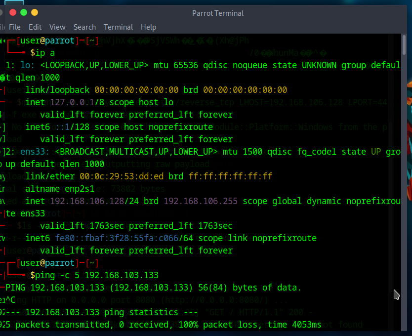

### 2. Génération et livraison du payload
Génération d'un payload `windows/meterpreter/reverse_tcp` avec
`msfvenom`, exposé via un serveur HTTP Python pour téléchargement
par la victime.
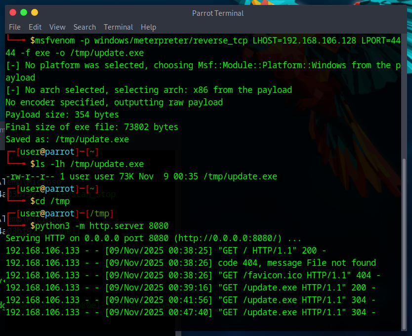

### 3. Vérification côté victime
Confirmation de la connectivité réseau entre la victime et
l'attaquant avant exécution du payload.
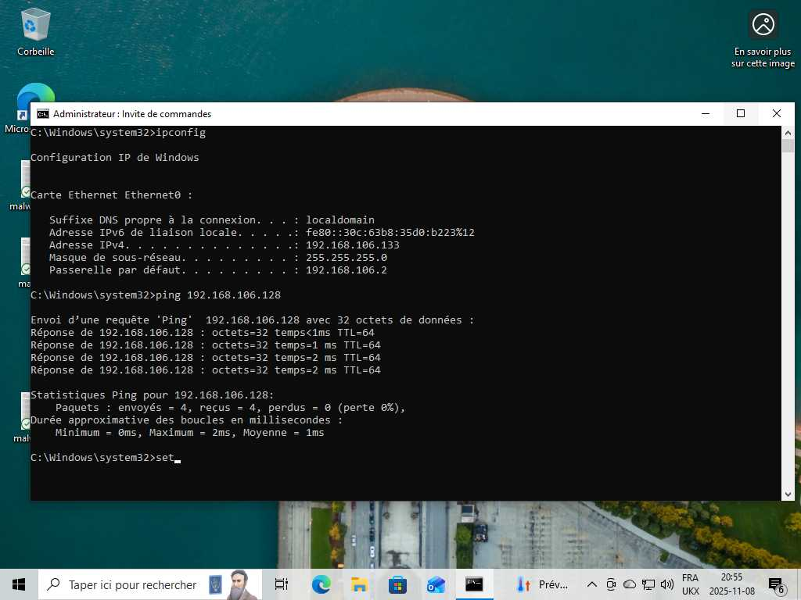

### 4. Configuration du service MSGRPC
Démarrage de `msfrpcd` pour permettre une interaction à distance
avec le framework Metasploit.
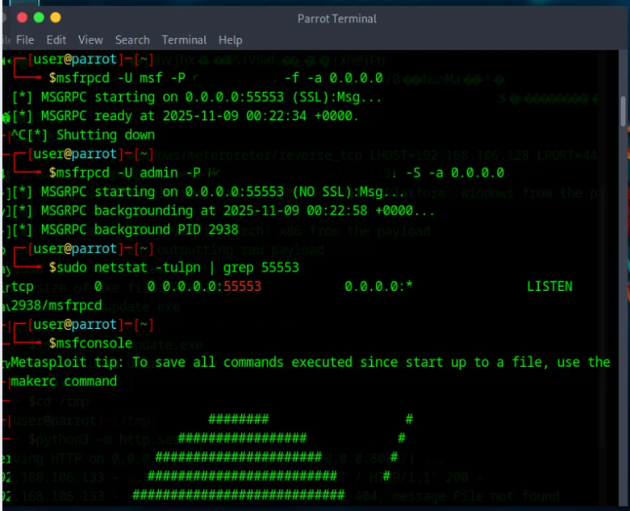

### 5. Connexion à msfconsole via RPC
Chargement du plugin `msgrpc` dans `msfconsole` pour piloter le
framework via l'API RPC.
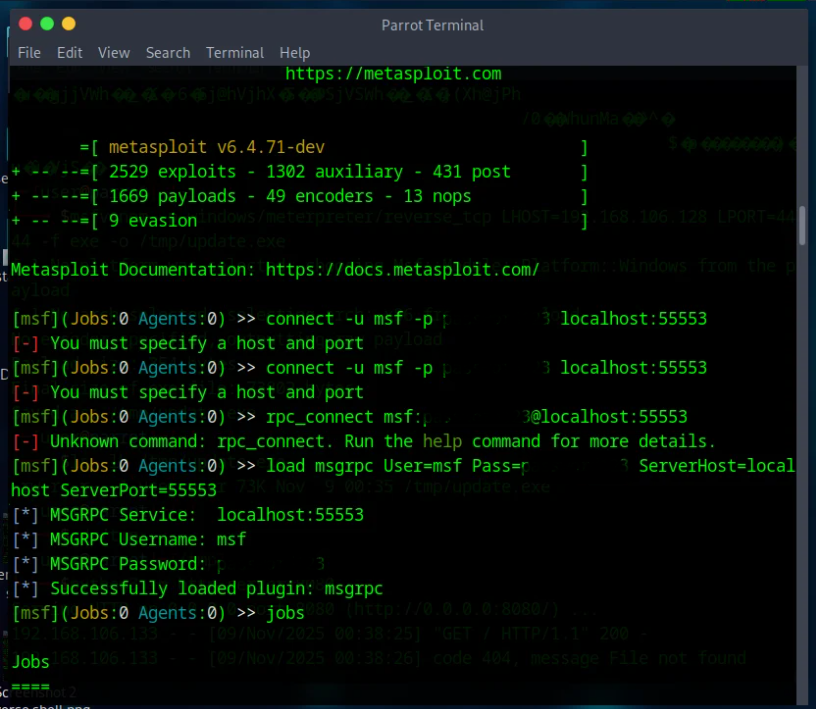

### 6. Configuration du handler d'écoute
Configuration du module `exploit/multi/handler` avec le payload,
l'adresse (`LHOST`) et le port d'écoute (`LPORT`) correspondant au
payload généré.
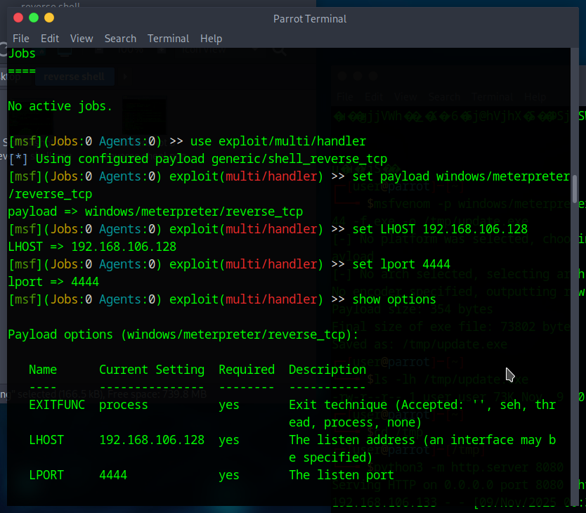

### 7. Vérification des options du handler
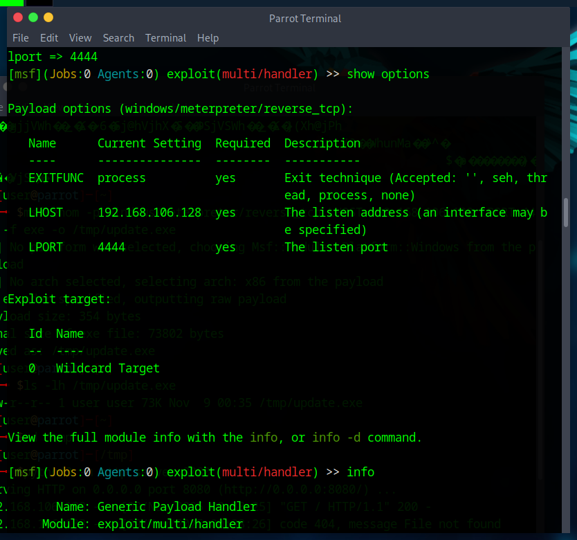

### 8. Lancement de l'écoute et obtention de la session
Le handler est lancé en tâche de fond. Dès l'exécution du payload
côté victime, une session Meterpreter s'établit.
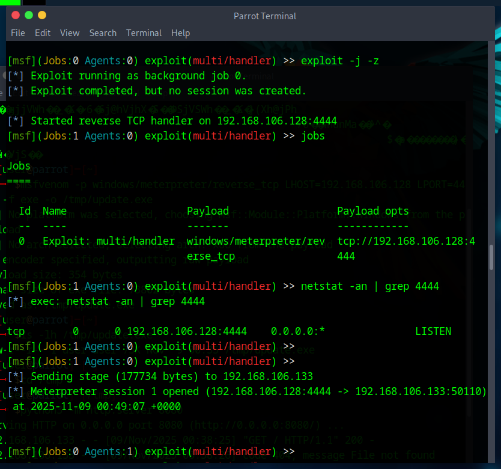

### 9. Reconnaissance post-exploitation
Interaction avec la session : informations système (`sysinfo`),
identité de l'utilisateur compromis (`getuid`), capture d'écran
à distance.
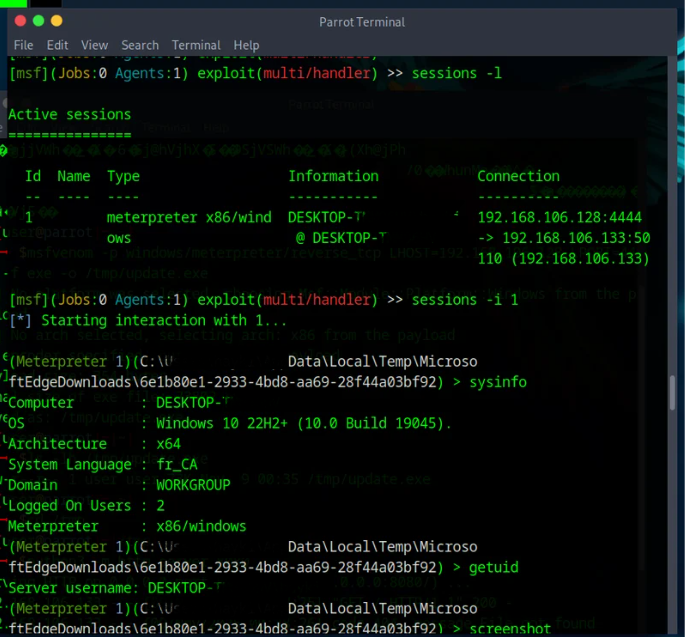

### 10. Shell interactif
Ouverture d'un shell `cmd.exe` distant via la session Meterpreter.
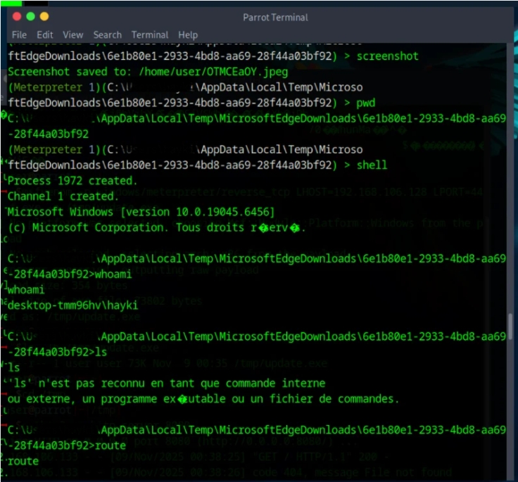

### 11. Post-exploitation avancée — Keylogging
Démonstration des capacités de surveillance : tentative d'accès
webcam, puis activation d'un enregistreur de frappe (`keyscan_start`
/ `keyscan_dump`) illustrant le risque d'espionnage silencieux.
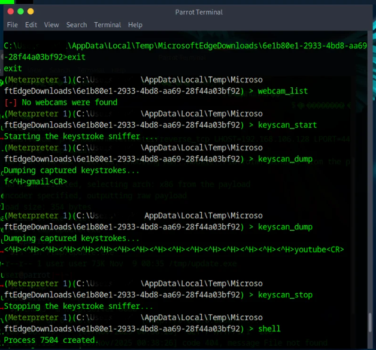

## Analyse — Chaîne d'attaque (Cyber Kill Chain)

| Étape | Kill Chain | Action réalisée |
|---|---|---|
| 1 | Weaponization | Génération du payload avec msfvenom |
| 2 | Delivery | Serveur HTTP simulant la distribution du fichier |
| 3 | Exploitation | Exécution du payload côté victime |
| 4 | Installation | Établissement de la session Meterpreter |
| 5 | C2 | Handler Metasploit comme canal de commande et contrôle |
| 6 | Actions on Objectives | Reconnaissance, capture d'écran, keylogging |

## Détection — Perspective Blue Team / SOC

- **EDR/Antivirus** : un exécutable non signé (`update.exe`) lancé
  depuis un dossier temporaire (`AppData\Local\Temp`) est un indicateur
  fort ; un bon EDR (Defender for Endpoint, CrowdStrike...) bloque ou
  alerte sur ce pattern
- **Réseau** : trafic sortant persistant sur un port non standard
  (4444) vers une IP interne inconnue — un signe classique de
  beaconing/C2
- **Processus** : `cmd.exe` lancé comme processus enfant d'un binaire
  suspect situé hors des dossiers systèmes habituels
- **Comportement** : activation de `keyscan_start` correspond à des
  appels API de type `SetWindowsHookEx` / `GetAsyncKeyState`,
  détectables par un EDR comportemental
- **Règle Sigma (exemple)** : détection d'un processus enfant `cmd.exe`
  ou `powershell.exe` lancé depuis `%TEMP%\MicrosoftEdgeDownloads\...`

## Recommandations de remédiation

1. Bloquer l'exécution de binaires non signés depuis les dossiers Temp/Downloads (AppLocker, WDAC)
2. Filtrage sortant (egress filtering) sur les ports non standards
3. Déploiement d'un EDR avec détection comportementale (pas seulement signatures)
4. Sensibilisation utilisateur : ne jamais exécuter un exécutable téléchargé depuis une source non vérifiée
5. Surveillance des appels API sensibles (hooks clavier, capture d'écran) via un EDR

## Compétences démontrées
`Metasploit Framework` `Meterpreter` `Génération de payload` `Post-exploitation`
`Analyse Cyber Kill Chain` `Détection EDR` `Detection Engineering (Sigma)`

## Outils utilisés
Parrot Security OS · Metasploit Framework · msfvenom · msfconsole · Windows 10
